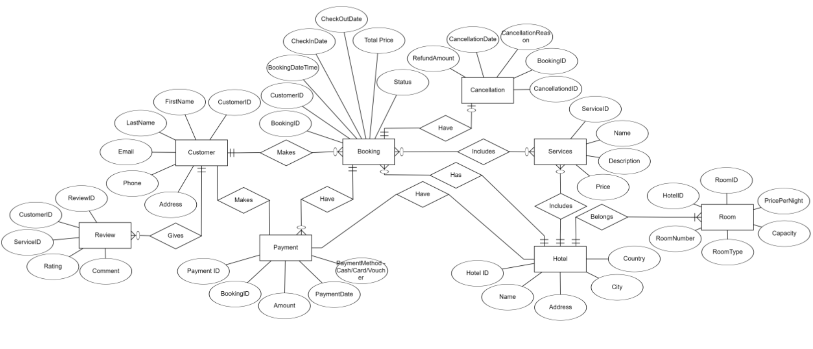
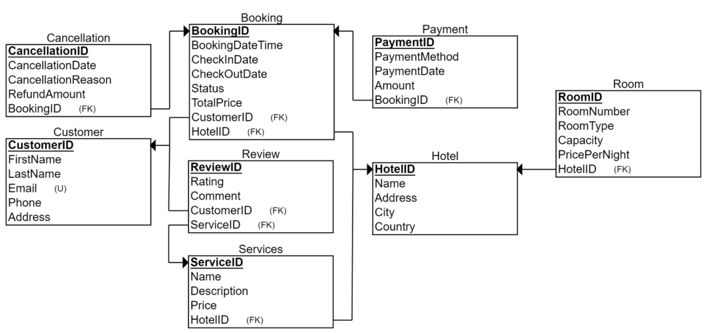

# 🗄️ Database Systems - Hotel Booking Database

Academic project developed at **Technical University of Košice - Faculty of Electrical Engineering and Informatics (FEI TUKE)** as part of the *Database Systems* course.

---
## 🚀 Project Overview
This repository contains the implementation of a **PostgreSQL relational database system** designed for managing hotel reservations and related services.

The project focuses on:
- relational database design
- normalization and entity relationships
- analytical data views
- server-side business logic
- automation using triggers and sequences

---
## 🧩 Database Domain
The system models a hotel booking environment including:

- customers and hotels
- room management
- reservations and payments
- additional services
- booking cancellations
- customer reviews

---
## ⚙️ Implemented Features

### Database Structure
- normalized relational schema
- foreign key relationships
- constraint-based data validation

### Views
Analytical and operational views providing:
- booking overview
- customer and hotel relations
- payment summaries
- service statistics

### Server-side Logic
Implemented using **PL/pgSQL**:

- functions for database operations
- stored procedures for automated workflows
- update logic through views

### Automation
- triggers for maintaining data consistency
- automatic ID generation using sequences
- business rule enforcement

---
## 🗺 Database Design

### Entity Relationship Diagram

### Relational Schema

---
## 📦 Repository Content
- `hotel-booking-database.sql` — full database implementation
- `hotel-booking-database.pdf` — project documentation
- `diagrams/` — ER and relational schema diagrams

---
## 🛠 Technologies
- PostgreSQL
- SQL (DDL / DML)
- PL/pgSQL
- Database normalization
- DataGrip

---
## 🎓 Academic Context
**Course:** Database Systems  
**University:** Technical University of Košice — FEI

---

👨‍💻 Author: **Dmytro Isai**
